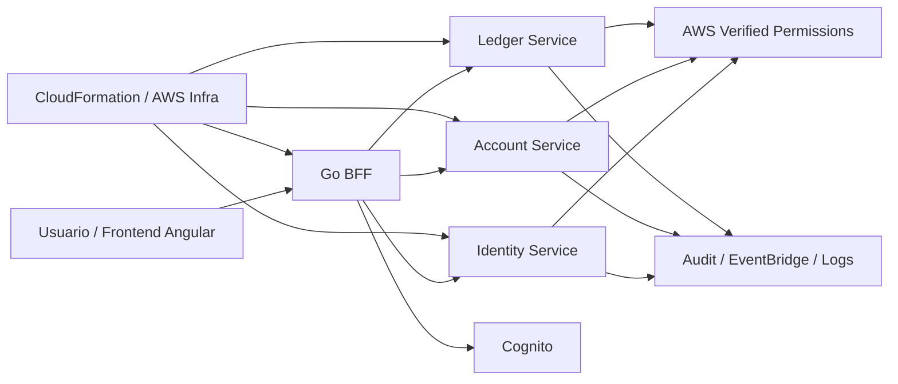

# Imaginary Bank — Secure Microservices Thesis

> Arquitectura de microservicios seguros orientada a banca digital, construida como proyecto de tesis y portafolio técnico.

## Descripción general

**Imaginary Bank** es un proyecto de tesis enfocado en el diseño e implementación de una plataforma bancaria basada en microservicios con un enfoque fuerte en **seguridad, trazabilidad, autorización fina y buenas prácticas cloud-native**.

El objetivo no es solo construir APIs funcionales, sino demostrar cómo diseñar un sistema distribuido bajo principios de **Zero Trust**, **defensa en profundidad**, **auditoría estructurada**, **autorización ABAC/ReBAC**, y controles alineados con estándares como **OWASP ASVS L3**.

Este repositorio también funciona como **portafolio técnico**, por lo que documenta no solo el código, sino la arquitectura, las decisiones de seguridad y la forma en que los componentes se integran entre sí.

---

## Objetivo del proyecto

Diseñar una arquitectura segura para una aplicación bancaria moderna que permita:

* autenticación centralizada y segura;
* autorización desacoplada y escalable;
* separación clara entre frontend, BFF y microservicios;
* trazabilidad end-to-end con auditoría estructurada;
* controles de seguridad reutilizables entre servicios;
* despliegue cloud-native en AWS mediante infraestructura como código.

---

## Enfoque de seguridad

Este proyecto fue concebido desde el inicio con una mentalidad **security-first**. Entre los controles y decisiones principales se incluyen:

* **Patrón BFF-first**: el navegador no interactúa directamente con los microservicios internos.
* **Autenticación con Cognito/JWT** y validación mediante **JWKS**.
* **Autorización centralizada con AWS Verified Permissions** usando políticas **Cedar**.
* **Modelo deny-by-default** para minimizar exposición accidental.
* **Resolución de recursos y ownership** antes de decisiones de autorización.
* **Auditoría estructurada** con un estándar propio de eventos (`AuditEvent JSON v1.0`).
* **Idempotencia** para operaciones sensibles y prevención de reintentos peligrosos.
* **Correlation ID** para trazabilidad entre componentes.
* **Mapeo seguro de errores**, evitando filtrar detalles internos al cliente.
* **Separación de responsabilidades** entre capa web, BFF, lógica de negocio y autorización.

---

## Arquitectura de alto nivel



### Componentes principales

* **imaginarybank-web**: frontend de la aplicación.
* **bff**: Backend for Frontend que centraliza validaciones, sesión, políticas de exposición y orquestación segura.
* **micro/identity**: microservicio orientado a identidad, onboarding y operaciones relacionadas con autenticación/registro.
* **micro/account**: microservicio de cuentas y lógica de dominio asociada.
* **micro/ledger**: microservicio orientado a movimientos, pagos y créditos.
* **infra**: plantillas de infraestructura como código, networking, datos, identidad, cómputo, auditoría y observabilidad.

---

## Estructura del repositorio

```text
microservice-workspace/
├── .aws/
├── .vscode/
├── bff/
├── imaginarybank-web/
├── infra/
├── micro/
│   ├── account/
│   ├── identity/
│   └── ledger/
├── docker-compose.yml
├── arch.md
└── README.md
```

### Qué contiene cada carpeta

#### `bff/`

Contiene el Backend for Frontend desarrollado para exponer una superficie controlada hacia el cliente. Aquí se concentran responsabilidades como:

* validación de sesión;
* propagación segura de identidad hacia microservicios;
* middlewares de seguridad;
* control de cookies/sesión;
* idempotencia y correlation IDs;
* traducción y endurecimiento de errores para la capa pública.

#### `imaginarybank-web/`

Aplicación frontend que consume el BFF. Esta capa está pensada para mantenerse desacoplada de la complejidad interna de autorización y comunicación entre servicios.

#### `micro/identity/`

Servicio encargado de flujos de identidad y onboarding, incluyendo integración con el esquema de autenticación/autorización definido para la plataforma.

#### `micro/account/`

Servicio que encapsula la lógica del dominio de cuentas, ownership de recursos, resolución de contexto para autorización y reglas operativas asociadas.

#### `micro/ledger/`

Servicio para operaciones transaccionales, movimientos, pagos y créditos, con énfasis en seguridad, idempotencia y validaciones de autorización contextual.

#### `infra/`

Define la infraestructura del proyecto con enfoque reproducible y modular. Aquí se estructura la base para networking, identidad, cómputo, datos y observabilidad en AWS.

---

## Principios de diseño aplicados

### 1. Seguridad desacoplada del negocio

La autorización no se deja “quemada” dentro de cada caso de uso. Se construye una capa reusable para resolver:

* quién es el principal;
* qué acción intenta ejecutar;
* sobre qué recurso;
* con qué contexto;
* qué política debe evaluarse.

### 2. BFF como punto de control

El BFF actúa como frontera de seguridad entre el cliente y los microservicios. Esto permite:

* reducir exposición directa;
* centralizar manejo de sesión;
* aplicar reglas uniformes de entrada/salida;
* proteger detalles internos de la arquitectura.

### 3. Observabilidad y auditoría como parte del diseño

No se trata solo de “registrar logs”. El proyecto busca producir eventos auditables y consistentes para trazabilidad, cumplimiento y análisis posterior.

### 4. Infraestructura versionada

La infraestructura se trata como código para asegurar repetibilidad, revisión y trazabilidad de cambios.

---

## Stack tecnológico

### Backend

* **Go** para el BFF y parte de los microservicios.
* **Java / Spring Boot** para servicios del dominio donde aplica.
* **gRPC** y/o integración interna entre servicios según el flujo.
* **REST/OpenAPI** para la capa expuesta por el BFF.

### Frontend

* **Angular** para la interfaz web.

### Seguridad

* **Amazon Cognito** para autenticación.
* **AWS Verified Permissions** para autorización basada en políticas.
* **Cedar** como lenguaje de políticas.
* **JWT + JWKS** para validación de identidad.

### Infraestructura / Cloud

* **AWS CloudFormation** para IaC.
* **AWS ECS Fargate** como estrategia principal de cómputo cloud-native
